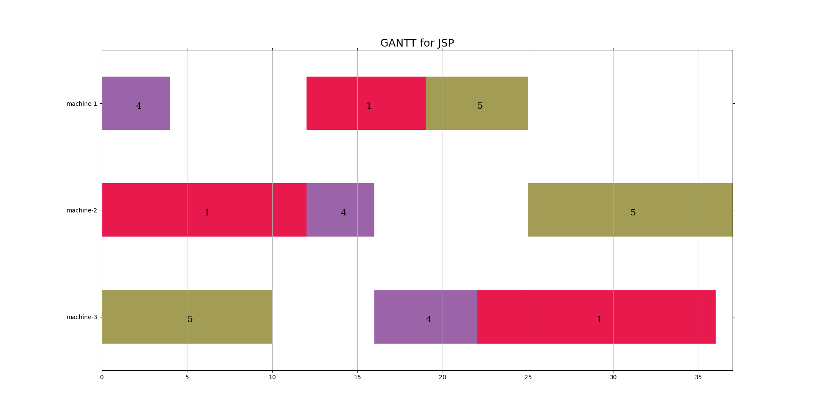

#### gantt for jsp 生成JSP问题的甘特图

在github上搜到了很多关于甘特图的项目，但是基本都是以日期为横轴的代码，要想使用到JSP（车间调度问题）问题中扔需修改代码。本项目思路来源于：[https://github.com/stefanSchinkel/gantt](https://github.com/stefanSchinkel/gantt)。与现存的已知的一些相比该项目的**优势**有：

1.使用python编写，无需vue等部署，本地即可使用；

2.配置文件```sample.json```内容与JSP问题的输出结果相同，（或仅需对解向量解码即可得到该形式），无需添加```label、color```等属性；

3.[@stefanSchinkel](https://github.com/stefanSchinkel)的gantt项目使用柱状图的形式实现，不能满足JSP对甘特图的要求，而应改为```mpatches.Rectangle```绘制的矩形；

4.背景颜色虽然随机生成，但是只会产生较浅的一些十六进制的颜色值，防止颜色太深影响```job```下标。

最后的效果上来看，可能并不能达到paper要求的美观程度，但是可以让研究JSP问题的人员可以清楚地得到makespan，而对于其他问题，如需要计算idle time的带有最小能量消耗的多目标优化的JSP问题，该图也方便得出机器的空闲时间并进行实验的验证。

#### 使用方法

使用```pip```指令下载运行所必要的包，python版本 3.10

```bash
pip install -r requirements.txt
```

修改您的代码的运行结果生成```sample.json```文件，文件内容如下

```json
{
  "packages": [
    {
      "start": 0,
      "end": 10,
      "machine": 3,
      "job": 5
    },
    {
      "start": 0,
      "end": 12,
      "machine": 2,
      "job": 1
    }
  ],
"title" : "GANTT for JSP",
"xlabel" : "time",
"machines": 3,
"jobs": 5
}
```

运行```gantt.py```程序

```python
python gantt.py
```

若要保存甘特图，将代码中如下语句解注释

```python
g.save('img/GANTT.png')
```


#### 项目效果


